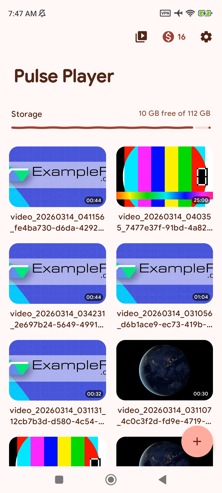
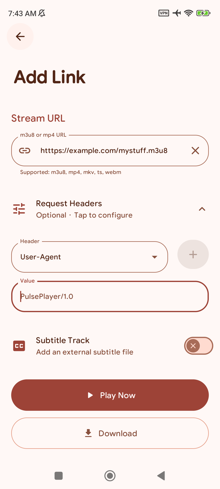
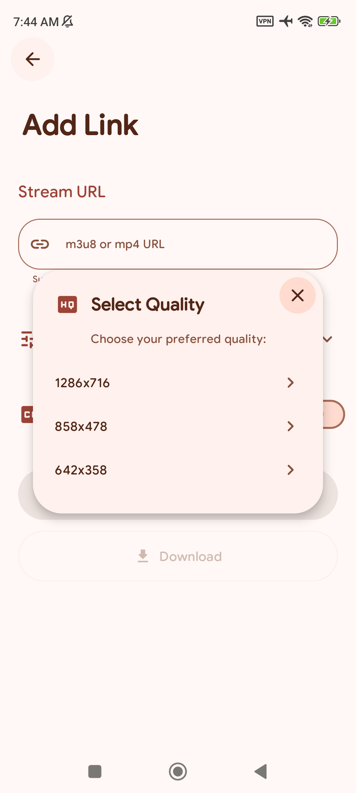
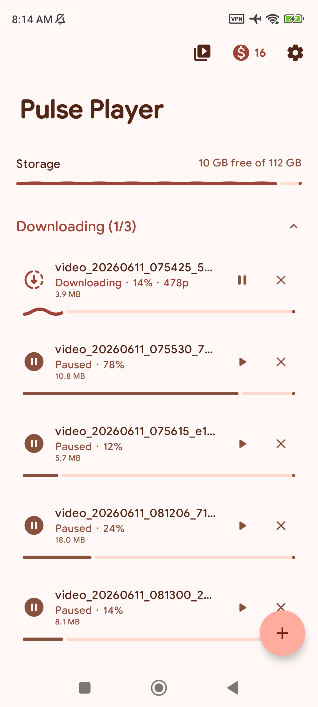
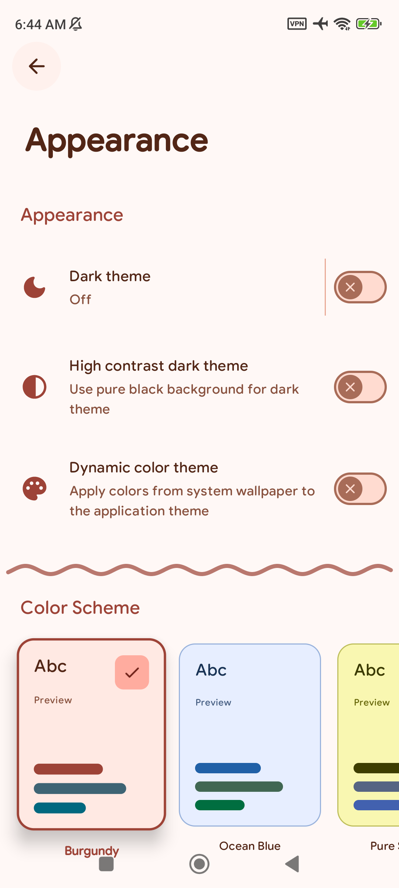

# pulse-player

  

Pulse Player is a native Android player for M3U8 HLS streams and MP4 files — local or over the network — with a built-in downloader, custom headers, subtitle support, and a coin reward system that keeps it free.

  
  
  
  
  

