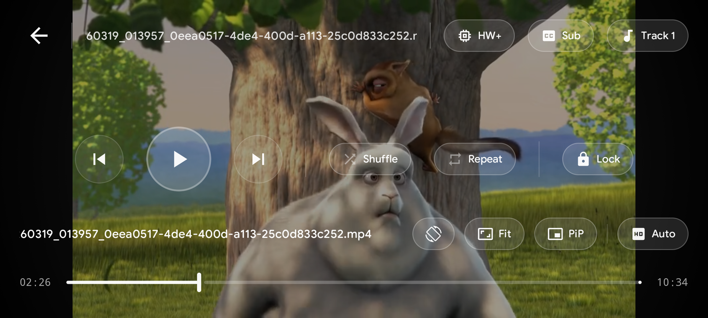
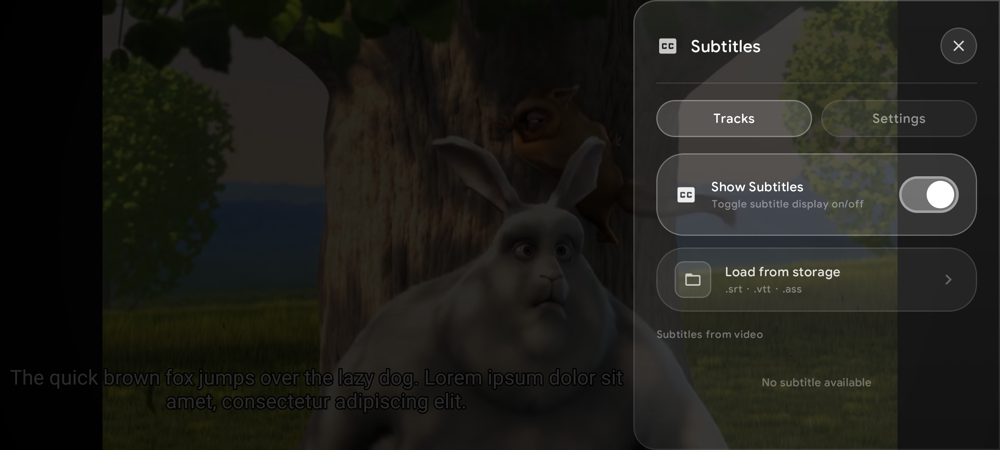

# pulse-player

    
    
    

Pulse Player is a native Android player for M3U8 HLS streams and MP4 files — local or over the network — with a built-in downloader, custom headers, subtitle support, and a coin reward system that keeps it free.

**This project is still in development and is expected to have bugs. Please report any bugs you find in
the [Issues](https://github.com/pulseplayer/pulse-player/issues) section.**

## Downloads

You can download Pulse Player from the [Releases section](https://github.com/pulseplayer/pulse-player/releases) or

## Screenshots

  
  
  
  
  

### Player Ui

  
  

## Supported formats

- **Video**: H.263, H.264 AVC (Baseline Profile; Main Profile on Android 6+), H.265 HEVC, MPEG-4 SP, VP8, VP9, AV1
    - Support depends on Android device
- **Audio**: Vorbis, Opus, FLAC, ALAC, PCM/WAVE (μ-law, A-law), MP1, MP2, MP3, AMR (NB, WB), AAC (LC, ELD, HE; xHE on Android 9+), AC-3, E-AC-3, DTS,
  DTS-HD, TrueHD
    - Support provided by ExoPlayer FFmpeg extension
- **Subtitles**: SRT, SSA, ASS, TTML, VTT, DVB
    - SSA/ASS has limited support

## Features

- Native Android app with simple and easy-to-use interface
- Software decoders for h264 and hevc
- Audio/Subtitle track selection
- Vertical swipe to change brightness (left) / volume (right)
- Horizontal swipe to seek through video
- [Material 3 (You)](https://m3.material.io/) support
- Play videos from url
- Play videos from storage access framework (Android Document picker)
- External Subtitle support
- Picture-in-picture mode
